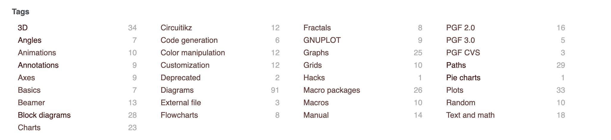
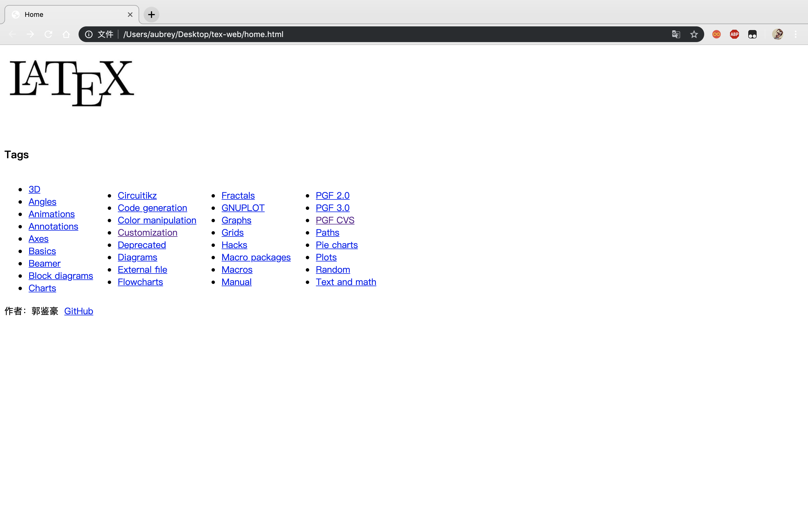
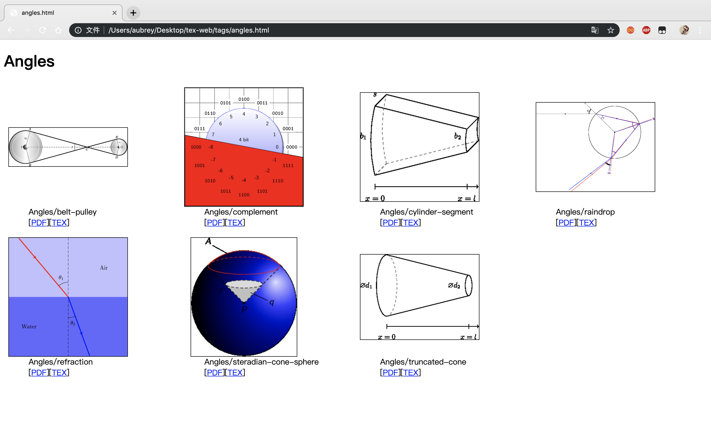

# Coding Task Report
**Author: 郭鉴豪 @ ZJU**

本工程共完成三个任务

1.基于Scrapy爬取[Texample](www.texmple.net/tikz/example)中所有`.tex`文件，并按照原网页归类的tag进行分类。

2.使用shell脚本，批量将得到的`.tex`文件编译成为`.pdf`，并使用ImageMagick另存为`.png`图片格式，同时修建图片白边，删除冗余部分。

3.制作HTML网页，上传上述资料，并按照它们在tag中的分类设置索引。

***目前工程基本功能均已实现，但尚有需要改进之处，将会在下文提及并在日后逐渐完善***

## 开发环境
- macOS 10.14.5
- Python 3.7.3
- Scrapy 1.6.0
- MacTeX 2019
- ImageMagick

## Scrapy爬虫
爬虫规则定义在`/newcrawl/newcrawl/spiders/crawl.py`中，在`/newcrawl`下执行：

`python3 main.py` 

爬取得到的`.tex`按照[Texample](www.texmple.net/tikz/example)中tag的分类存储在`/result`中。网页服务器上共有424条`.tex`文件，因为同一文件可能属于多个tag，实际获得503条（含重复）`.tex`文件。

## TEX to PNG
### TEX to PDF
在`/newcrawl`下运行：

`sh tex2pdf.sh`

生成的`.pdf`和源文件放在同一目录中。有59个`.tex`文件编译失败，暂时将这些文件整理在`/newcrawl/unsuccessful`文件夹内，完成其他文件的编译。详见[To be Done 1](#jump1)

### PDF to PNG
ImageMagick是一款功能强大的图像处理软件，可以实现改变文件格式，自动裁剪白边的目的，首先需要安装ImageMagick：

`brew install ImageMagick`

完成安装后，在`/newcrawl`下执行：

`sh pdf2png.sh`

实现格式转换，并存放在`/png`中。直接从pdf到png会让图像背景和线条变透明，所以先将pdf转为不透明的jpg再转为png。

实现了自动裁剪白边，防止在网页浏览时出现大量空白的情况，但目前自动裁剪存在一个bug，见[To be Done 2](#jump2)

## 网页搭建
网页使用html，目录为`/tex-web`,主页为`/tex-web/home.html`，其他页面在`/tex-web/tags`内。

在每个分类标签中，可以查看该类的所有图片，并提供`.png`,`.pdf`,`.tex`文件链接，图片显示实现了自动适应页面大小。

## To be Done
1.  由于使用的是默认的MacTex环境，在编译某些文件时会出现缺少宏包，环境变量未定义等问题，导致有59个`.tex`文件编译失败,且部分pdf生成的不完整。由于各个文件报错不尽相同，需要配置的环境也比较复杂，所以暂时将这些报错文件整理在`/newcrawl/unsuccessful`文件夹内，编译成功但pdf不完整的暂时保留，完成其他文件的编译。下一步需要逐个配置相应的latex环境，从而能够将全部tex成功编译，后续更新只需要把目录里的`/png`替换即可。

2.  部分pdf使用自动裁剪边框后仍然存在白边，原因是pdf的页码干扰了裁剪（如图），解决这一情况需要加入人工处理，如果有时间会完成。

3. 网页显示图片时可能会出现奇怪的排版问题（如图），由于刚接触前端网页制作，所以网页比较简陋，也缺少接口，可能会在后续学习中逐渐完善

## Bonus Question
### How to compile latex in browser?

There is one line in the source code, which is: ` `, the js code runs on the website and a click on the button calls an event to compile the latex code.

### Webassembly?
Webassembly and JavaScript are used for web programming, they define the actions to be carried out on website. Webassembly compiles advanced language and executes binary code on website. And it is more efficient and faster than JavaScript.
It seems that webassembly is growing more and more popular, it may replace JS someday. 

### Recommendation?
This sounds like a supervised-learning problem, so we can use the choices that one user had made to catagory this user into different kinds, such as uneducated, high school, bachelor degree, or higher. And those recommendations need to correspond to different degrees. Thus we can match the user and the recommendations.

Naive Bayes can be of help, we need to ask for feedback from users, after that the possibility that one likes or dislikes a recommendations can be estimated, according to previous choices and feedbacks of him. 

